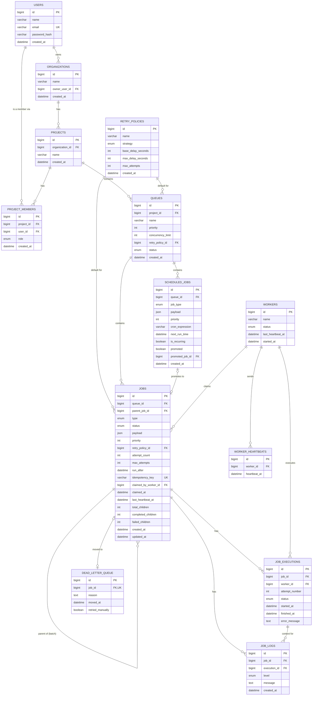

# Distributed Job Scheduler


A production-inspired backend system for reliably executing asynchronous background jobs across multiple concurrent workers — similar in spirit to Celery or Sidekiq.

**Live demo:** _[URL to be added after deployment]_
---

## Table of Contents

- [What it does](#what-it-does)
- [Tech stack](#tech-stack)
- [Architecture highlights](#architecture-highlights)
- [Database schema](#database-schema)
  - [ER Diagram](#er-diagram)
  - [Table reference](#table-reference)
- [Running locally](#running-locally)
- [API overview](#api-overview)
- [Testing](#testing)
- [Known limitations](#known-limitations)
- [Project structure](#project-structure)

---

## What it does

- Multi-project / multi-queue job management with per-project RBAC (Owner / Member / Viewer)
- Five job types: immediate, delayed, scheduled, recurring (cron), and batch
- A worker engine that polls queues, atomically claims jobs, executes them concurrently on a thread pool, and sends heartbeats
- Full job lifecycle: `QUEUED → CLAIMED → RUNNING → COMPLETED`, with configurable retries (fixed / linear / exponential backoff) and a Dead Letter Queue for exhausted jobs
- Execution logs, retry history, and worker assignment tracked per job
- A live dashboard (HTML/CSS/vanilla JS + Chart.js) showing queues, jobs, workers, and DLQ entries in real time

### Bonus features (all three implemented in full)

| Feature | How it works |
|---|---|
| **WebSocket live updates** | Job and worker status changes push over STOMP/SockJS to subscribed dashboard clients — no polling needed for state changes |
| **Distributed locking** | Atomic job claiming via `SELECT ... FOR UPDATE SKIP LOCKED` in MySQL, so no job is ever claimed by two workers at once |
| **RBAC** | Owner / Member / Viewer roles enforced per-project at the service layer |

---

## Tech stack

| Layer | Technology |
|---|---|
| Backend | Java 23, Spring Boot 4.0.8 |
| Security | Spring Security + JWT (jjwt 0.12.6) |
| Persistence | Spring Data JPA / Hibernate, MySQL 8.0 |
| Realtime | Spring WebSocket (STOMP over SockJS) |
| Frontend | HTML, CSS, vanilla JavaScript, Chart.js |
| Build | Maven |

---

## Architecture highlights

- **Atomic job claiming** — `SELECT ... FOR UPDATE SKIP LOCKED` guarantees exactly-once claiming across concurrent workers with no external broker.
- **Two-row staging model** — delayed/scheduled/cron jobs are written to `scheduled_jobs` first; a dedicated Scheduler component promotes due rows into the live `jobs` table using the same SKIP LOCKED discipline. Cron recurrence always inserts a fresh row for the next occurrence rather than updating in place, preserving an auditable promotion history.
- **Worker Engine** — a single worker process with a configurable multi-threaded pool (default 5 threads) polls all active queues, claims jobs, executes them, and sends heartbeats.
- **Reaper** — a separate scheduled task detects jobs stuck in `RUNNING` whose worker stopped heartbeating, marks the worker `UNRESPONSIVE`, and routes the job back through the normal retry/DLQ decision.
- **Batch jobs** — a self-referential `parent_job_id` links a batch parent to its children, with denormalized `completed_children`/`failed_children` counters on the parent used to derive its final status once every child resolves.
- **WebSocket topics** — per-queue job events on `/topic/queues/{queueId}/jobs`, plus one global `/topic/workers` topic for worker status. Broadcasts fire only on real state transitions (claim, run, complete, retry, dead-letter, batch resolution, worker status change) — heartbeat ticks and aggregate queue stats are deliberately excluded to avoid flooding clients; queue stats are polled via REST instead.

Full design rationale (every decision, alternatives considered, and trade-offs) is documented in [`docs/design-decisions.md`](docs/design-decisions.md).

---

## Database schema

13 tables. Full DDL lives in [`src/main/resources/schema.sql`](src/main/resources/schema.sql).

### ER Diagram



### Table reference

<details>
<summary><strong>users</strong> — application accounts</summary>

| Column | Type | Constraints |
|---|---|---|
| `id` | `bigint` | PK, auto-increment |
| `name` | `varchar(120)` | not null |
| `email` | `varchar(190)` | not null, unique |
| `password_hash` | `varchar(255)` | not null (BCrypt) |
| `created_at` | `datetime` | not null |
</details>

<details>
<summary><strong>organizations</strong> — auto-created per user on first project</summary>

| Column | Type | Constraints |
|---|---|---|
| `id` | `bigint` | PK, auto-increment |
| `name` | `varchar(150)` | not null |
| `owner_user_id` | `bigint` | FK → `users.id`, not null |
| `created_at` | `datetime` | not null |
</details>

<details>
<summary><strong>projects</strong> — top-level container for queues</summary>

| Column | Type | Constraints |
|---|---|---|
| `id` | `bigint` | PK, auto-increment |
| `organization_id` | `bigint` | FK → `organizations.id`, not null |
| `name` | `varchar(150)` | not null |
| `created_at` | `datetime` | not null |
</details>

<details>
<summary><strong>project_members</strong> — RBAC: who has what role on which project</summary>

| Column | Type | Constraints |
|---|---|---|
| `id` | `bigint` | PK, auto-increment |
| `project_id` | `bigint` | FK → `projects.id`, not null |
| `user_id` | `bigint` | FK → `users.id`, not null |
| `role` | `enum('OWNER','MEMBER','VIEWER')` | not null, default `MEMBER` |
| `created_at` | `datetime` | not null |

Unique constraint on `(project_id, user_id)` — one role per user per project.
</details>

<details>
<summary><strong>retry_policies</strong> — reusable retry configurations</summary>

| Column | Type | Constraints |
|---|---|---|
| `id` | `bigint` | PK, auto-increment |
| `name` | `varchar(100)` | not null |
| `strategy` | `enum('FIXED','LINEAR','EXPONENTIAL')` | not null |
| `base_delay_seconds` | `int` | not null, default `30` |
| `max_delay_seconds` | `int` | not null, default `3600` |
| `max_attempts` | `int` | not null, default `5` |
| `created_at` | `datetime` | not null |
</details>

<details>
<summary><strong>queues</strong> — per-project job queues</summary>

| Column | Type | Constraints |
|---|---|---|
| `id` | `bigint` | PK, auto-increment |
| `project_id` | `bigint` | FK → `projects.id`, not null |
| `name` | `varchar(120)` | not null |
| `priority` | `int` | not null, default `0` |
| `concurrency_limit` | `int` | not null, default `5` |
| `retry_policy_id` | `bigint` | FK → `retry_policies.id`, nullable |
| `status` | `enum('ACTIVE','PAUSED')` | not null, default `ACTIVE` |
| `created_at` | `datetime` | not null |
</details>

<details>
<summary><strong>workers</strong> — worker process instances</summary>

| Column | Type | Constraints |
|---|---|---|
| `id` | `bigint` | PK, auto-increment |
| `name` | `varchar(150)` | not null |
| `status` | `enum('ACTIVE','UNRESPONSIVE','DEAD','SHUTDOWN')` | not null, default `ACTIVE` |
| `last_heartbeat_at` | `datetime` | nullable |
| `started_at` | `datetime` | not null |
</details>

<details>
<summary><strong>worker_heartbeats</strong> — heartbeat history per worker</summary>

| Column | Type | Constraints |
|---|---|---|
| `id` | `bigint` | PK, auto-increment |
| `worker_id` | `bigint` | FK → `workers.id`, not null |
| `heartbeat_at` | `datetime` | not null |
</details>

<details>
<summary><strong>jobs</strong> — the central table: every live, claimable, or resolved job</summary>

| Column | Type | Constraints |
|---|---|---|
| `id` | `bigint` | PK, auto-increment |
| `queue_id` | `bigint` | FK → `queues.id`, not null |
| `parent_job_id` | `bigint` | FK → `jobs.id` (self-referential), nullable — batch children only |
| `type` | `enum('IMMEDIATE','DELAYED','SCHEDULED','CRON','BATCH')` | not null |
| `status` | `enum('QUEUED','SCHEDULED','CLAIMED','RUNNING','COMPLETED','FAILED','DEAD_LETTER','PARTIALLY_FAILED')` | not null, default `QUEUED` |
| `payload` | `json` | job's input data |
| `priority` | `int` | not null, default `0` |
| `retry_policy_id` | `bigint` | FK → `retry_policies.id`, nullable |
| `attempt_count` | `int` | not null, default `0` |
| `max_attempts` | `int` | not null, default `5` |
| `run_after` | `datetime` | nullable — job not claimable until this time |
| `idempotency_key` | `varchar(190)` | nullable, **globally** unique |
| `claimed_by_worker_id` | `bigint` | FK → `workers.id`, nullable |
| `claimed_at` | `datetime` | nullable |
| `last_heartbeat_at` | `datetime` | nullable — used by the Reaper |
| `total_children` | `int` | not null, default `0` — batch parents only |
| `completed_children` | `int` | not null, default `0` |
| `failed_children` | `int` | not null, default `0` |
| `created_at` | `datetime` | not null |
| `updated_at` | `datetime` | not null |

Hot-path composite index: `idx_jobs_claim_poll (queue_id, status, run_after, priority)`.
</details>

<details>
<summary><strong>scheduled_jobs</strong> — staging table for delayed/scheduled/cron jobs, pre-promotion</summary>

| Column | Type | Constraints |
|---|---|---|
| `id` | `bigint` | PK, auto-increment |
| `queue_id` | `bigint` | FK → `queues.id`, not null |
| `job_type` | `enum('DELAYED','SCHEDULED','CRON')` | not null |
| `payload` | `json` | job's input data |
| `priority` | `int` | not null, default `0` |
| `cron_expression` | `varchar(120)` | nullable — CRON type only |
| `next_run_time` | `datetime` | not null |
| `is_recurring` | `boolean` | not null, default `false` |
| `promoted` | `boolean` | not null, default `false` |
| `promoted_job_id` | `bigint` | FK → `jobs.id`, nullable, set once promoted |
| `created_at` | `datetime` | not null |

Hot-path index: `idx_scheduled_poll (promoted, next_run_time)`. No `idempotency_key` or `max_attempts` column — these apply only after promotion.
</details>

<details>
<summary><strong>job_executions</strong> — one row per execution attempt</summary>

| Column | Type | Constraints |
|---|---|---|
| `id` | `bigint` | PK, auto-increment |
| `job_id` | `bigint` | FK → `jobs.id`, not null |
| `worker_id` | `bigint` | FK → `workers.id`, nullable |
| `attempt_number` | `int` | not null |
| `status` | `enum('RUNNING','SUCCESS','FAILURE')` | not null |
| `started_at` | `datetime` | not null |
| `finished_at` | `datetime` | nullable |
| `error_message` | `text` | nullable |
</details>

<details>
<summary><strong>job_logs</strong> — INFO/WARN/ERROR log lines per job</summary>

| Column | Type | Constraints |
|---|---|---|
| `id` | `bigint` | PK, auto-increment |
| `job_id` | `bigint` | FK → `jobs.id`, not null |
| `execution_id` | `bigint` | FK → `job_executions.id`, nullable |
| `level` | `enum('INFO','WARN','ERROR')` | not null, default `INFO` |
| `message` | `text` | not null |
| `created_at` | `datetime` | not null |
</details>

<details>
<summary><strong>dead_letter_queue</strong> — jobs that exhausted all retry attempts</summary>

| Column | Type | Constraints |
|---|---|---|
| `id` | `bigint` | PK, auto-increment |
| `job_id` | `bigint` | FK → `jobs.id`, not null, unique (1:1) |
| `reason` | `text` | nullable |
| `moved_at` | `datetime` | not null |
| `retried_manually` | `boolean` | not null, default `false` |
</details>

**Cascade rules:** deleting a project cascades to its queues and jobs; deleting a job cascades to its executions, logs, and DLQ entry; deleting a user is `RESTRICT`ed if they own an organization.

---

## Running locally

### Prerequisites
- Java 23
- Maven
- MySQL 8.0+

### 1. Create the database
```sql
CREATE DATABASE job_scheduler;
CREATE USER 'job_scheduler_user'@'localhost' IDENTIFIED BY 'your_password';
GRANT ALL PRIVILEGES ON job_scheduler.* TO 'job_scheduler_user'@'localhost';
```
Then run `src/main/resources/schema.sql` against it.

### 2. Set environment variables

> **Known issue:** `spring-dotenv` does not currently load `.env` files correctly under Spring Boot 4.0.8 in this project (suspected version incompatibility) — env vars silently fail to inject. Until resolved, set the variables below directly via your IDE's Run Configuration, or export them in your shell before running, rather than relying on a `.env` file.

| Variable | Purpose | Default |
|---|---|---|
| `DB_HOST` | MySQL host | `localhost` |
| `DB_PORT` | MySQL port | `3306` |
| `DB_NAME` | MySQL database name | `job_scheduler` |
| `DB_USERNAME` | MySQL user | `job_scheduler_user` |
| `DB_PASSWORD` | MySQL password | — |
| `JWT_SECRET` | HMAC-SHA key, **must be 32+ characters** | — |
| `JWT_EXPIRATION_MS` | JWT expiry in ms | `86400000` |
| `SERVER_PORT` | App port | `8080` |
| `WORKER_POOL_SIZE` | Worker thread pool size | `5` |
| `WORKER_POLL_INTERVAL_MS` | Queue poll interval | `2000` |
| `WORKER_HEARTBEAT_INTERVAL_MS` | Heartbeat tick interval | `10000` |
| `WORKER_HEARTBEAT_TIMEOUT_SECONDS` | Reaper staleness threshold | `30` |
| `WORKER_REAPER_INTERVAL_MS` | Reaper poll interval | `15000` |
| `SCHEDULER_POLL_INTERVAL_MS` | Delayed/cron promotion poll interval | `2000` |
| `SCHEDULER_BATCH_SIZE` | Max rows promoted per poll | `20` |

### 3. Run
```bash
mvn spring-boot:run
```
The app serves both the API and the static dashboard frontend at `http://localhost:8080`.

---

## API overview

All endpoints except `/api/auth/**` and the WebSocket handshake (`/ws/**`) require `Authorization: Bearer <token>`.

| Area | Endpoints |
|---|---|
| Auth | `POST /api/auth/register`, `POST /api/auth/login` |
| Projects | `POST /api/projects`, `GET /api/projects`, `POST /api/projects/{id}/members`, `GET /api/projects/{id}/members` |
| Queues | `POST /api/projects/{id}/queues`, `GET /api/projects/{id}/queues`, `PATCH /api/queues/{id}/pause`, `PATCH /api/queues/{id}/resume`, `GET /api/queues/{id}/stats` |
| Jobs | `POST /api/queues/{id}/jobs/{immediate\|delayed\|scheduled\|cron\|batch}`, `GET /api/queues/{id}/jobs` |
| WebSocket | `ws://<host>/ws` — subscribe to `/topic/queues/{queueId}/jobs` and `/topic/workers` |

Full request/response examples for every endpoint, plus the complete WebSocket event reference, are in [`docs/api-reference.md`](docs/api-reference.md).

---

## Testing

- `test_worker_engine.sh` — automated bash/curl/jq script covering job claiming, retries, DLQ, heartbeats, and batch aggregation
- Manual RBAC verification via Postman (positive and negative cases across Owner/Member/Viewer)
- WebSocket flows verified live via a browser-console STOMP client, confirming the full `CLAIMED → RUNNING → COMPLETED` event sequence and worker `ACTIVE` events firing in real time

---

## Known limitations

- `spring-dotenv` does not currently load `.env` files under Spring Boot 4.0.8 — see the environment variable setup note above.
- `GlobalExceptionHandler` does not yet return a `400` for malformed path variables (e.g. non-numeric `{queueId}`) — falls through to `500`.
- The WebSocket handshake endpoint (`/ws/**`) is not JWT-authenticated — any client that can reach the server can subscribe to any topic. Acceptable for this project's scope as a single-tenant demo, but would need addressing for a real multi-tenant deployment.
- Batch job responses don't yet expose live child-progress counters (e.g. "2 of 3 done") mid-batch.
- Only single-worker-instance concurrency has been tested; multiple concurrent worker processes are architecturally supported (via SKIP LOCKED) but not load-tested.

---

## Project structure

```
src/main/java/com/jobscheduler/distributed_job_scheduler/
├── config/          # Security, WebSocket config
├── controller/      # REST controllers
├── dto/             # Request/response DTOs (auth, project, queue, job, websocket)
├── entity/          # JPA entities
├── exception/       # Global exception handling
├── repository/      # Spring Data JPA repositories
├── scheduler/       # Delayed/cron job promotion
├── security/        # JWT filter, utils
├── service/         # Business logic + RBAC
├── worker/          # Worker engine, job execution, retry/DLQ, reaper
└── websocket/       # Event publisher
src/main/resources/
├── static/          # Dashboard frontend (HTML/CSS/JS + Chart.js)
├── schema.sql
└── application.properties
```

---

## Author

Shashank Zarikar — [GitHub](https://github.com/shashankzarikar/Distributed-Job-Scheduler)
