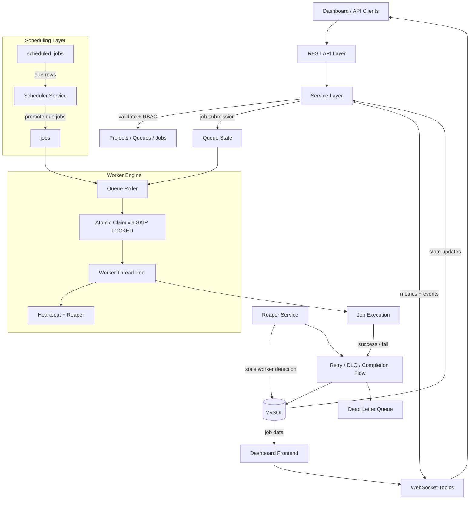

# Distributed Job Scheduler


A production-inspired backend system for reliably executing asynchronous background jobs across multiple concurrent workers — similar in spirit to Celery or Sidekiq — with atomic distributed job claiming, configurable retries, a Dead Letter Queue, per-project RBAC, live WebSocket updates, and a full web dashboard.

For a broader product overview and project context, see [`docs/project_overview.md`](docs/project_overview.md). For the system design and architecture diagram, see [`docs/architecture.md`](docs/architecture.md).

Built as a technical assignment, but engineered to the standard of a real internal tooling service: every reliability edge case (crashed workers, duplicate inserts, timezone bugs, transaction-boundary races) below was found through deliberate testing and fixed, not assumed away.

**Live demo:** _[URL to be added after deployment]_

---

## Table of Contents

- [What it does](#what-it-does)
- [Tech stack](#tech-stack)
- [Architecture highlights](#architecture-highlights)
- [Database schema](#database-schema)
  - [ER Diagram](#er-diagram)
  - [Table reference](#table-reference)
- [Running locally](#running-locally)
- [API overview](#api-overview)
- [Dashboard frontend](#dashboard-frontend)
- [Testing](#testing)
  - [Test suite overview](#test-suite-overview)
  - [Running the tests](#running-the-tests)
- [Known limitations](#known-limitations)
- [Project structure](#project-structure)
- [Engineering notes](#engineering-notes)

---

## What it does

- Multi-project / multi-queue job management with per-project RBAC (Owner / Member / Viewer)
- Five job types: **immediate**, **delayed**, **scheduled**, **recurring (cron)**, and **batch**
- A worker engine that polls active queues, atomically claims jobs, executes them concurrently on a thread pool, and sends heartbeats
- Full job lifecycle: `QUEUED → CLAIMED → RUNNING → COMPLETED`, with configurable retries (fixed / linear / exponential backoff) and a **Dead Letter Queue** for exhausted jobs — including a manual "retry from DLQ" action
- A dedicated **Reaper** that detects workers that die mid-job (crashed, killed, network-partitioned) via heartbeat timeout, and safely routes the stuck job back through the normal retry/DLQ decision
- Execution logs, retry history, and worker assignment tracked per job
- A live dashboard (HTML/CSS/vanilla JS + Chart.js) showing projects, queues, a real-time job explorer, worker status, and the DLQ — all served directly by the same Spring Boot app, no separate frontend deployment

### Bonus features (all three implemented in full, not partially)

| Feature | How it works |
|---|---|
| **WebSocket live updates** | Job and worker status changes push over STOMP/SockJS to subscribed dashboard clients in real time — no polling needed for state changes. Every event type (claim, run, complete, retry, dead-letter, batch resolution, worker active/unresponsive/shutdown) has been individually watched firing live, not just reasoned about from code. |
| **Distributed locking** | Atomic job claiming via `SELECT ... FOR UPDATE SKIP LOCKED` in MySQL, so no job is ever claimed by two workers at once. The same pattern also guards the delayed/scheduled/cron promotion poller. |
| **RBAC** | Owner / Member / Viewer roles enforced per-project at the service layer via two reusable helper methods (`requireRole`, `requireMembership`), reused identically by every service — no RBAC logic duplicated anywhere. |

---

## Tech stack

| Layer | Technology |
|---|---|
| Backend | Java 23, Spring Boot 4.0.8 |
| Security | Spring Security + JWT (`jjwt` 0.12.6), stateless sessions |
| Persistence | Spring Data JPA / Hibernate 7, MySQL 8.0 |
| JSON | Jackson 3 (`tools.jackson.*` — Spring Boot 4 ships Jackson 3, not Jackson 2) |
| Realtime | Spring WebSocket (STOMP over SockJS) |
| Frontend | HTML, CSS, vanilla JavaScript, Chart.js (via CDN) — no build step |
| Env/secrets | `.env` file via `springboot4-dotenv` (see [Running locally](#running-locally)) |
| Build | Maven |

---

## Architecture highlights

- **Atomic job claiming.** `SELECT ... FOR UPDATE SKIP LOCKED` guarantees exactly-once claiming across concurrent workers with no external message broker. Proven under real concurrent load with a fixed-size thread pool racing to claim jobs.
- **Two-row staging model.** Delayed/scheduled/cron jobs are written to `scheduled_jobs` first; a dedicated Scheduler component polls and promotes due rows into the live `jobs` table using the exact same SKIP LOCKED discipline, inside a single transaction so the row locks stay held through the promote step. Cron recurrence always inserts a **fresh** `scheduled_jobs` row for the next occurrence rather than updating in place, preserving an auditable promotion history.
- **Worker Engine.** A single worker process with a configurable multi-threaded pool (default 5 threads) polls all active queues, claims jobs up to each queue's concurrency limit, executes them, and sends periodic heartbeats while a job is running.
- **Reaper.** A separate scheduled task detects jobs stuck in `RUNNING` whose worker stopped heartbeating, marks the worker `UNRESPONSIVE`, and routes the job back through the normal retry/DLQ decision via a single shared `JobOutcomeHandler` — so retry, DLQ, and batch-aggregation logic exists in exactly one place, whether a job failed normally or was reaped.
- **Batch jobs.** A self-referential `parent_job_id` links a batch parent to its children, with denormalized `completed_children`/`failed_children` counters on the parent used to derive its final status (`COMPLETED` / `FAILED` / `PARTIALLY_FAILED`) once every child resolves.
- **Dead Letter Queue with manual retry.** Jobs that exhaust all attempts move to `dead_letter_queue` with a recorded reason. A dedicated endpoint lets an operator manually retry a dead-lettered job with a full fresh attempt budget, directly from the dashboard.
- **WebSocket topics.** Per-queue job events on `/topic/queues/{queueId}/jobs`, plus one global `/topic/workers` topic for worker status. Broadcasts fire only on real state transitions — heartbeat ticks and aggregate queue stats are deliberately excluded to avoid flooding clients; queue stats are polled via REST instead, which also feeds the dashboard's live Chart.js graphs.
- **Self-invocation avoided by design.** Transactional lifecycle operations (claim, mark-running, heartbeat) live in a dedicated `JobLifecycleService` bean rather than as `@Transactional` methods called from within the same class — sidestepping a well-known Spring pitfall where same-class method calls bypass the transactional proxy entirely.

A full narrative of every design decision, alternative considered, and real bug found-and-fixed during development (timezone corruption, a duplicate-insert bug that could crash the Reaper indefinitely, a silent exception-swallowing gap, and more) is documented in [`docs/design_decisions.md`](docs/design_decisions.md).

For the architecture diagram and broader system context, see [`docs/architecture.md`](docs/architecture.md).

### Architecture diagram



---

## Database schema

13 tables. Full DDL lives in [`docs/schema.sql`](docs/schema.sql).

### ER Diagram

The full ER diagram is documented in [`docs/database_schema.md`](docs/database_schema.md). It covers the core entity relationships between projects, queues, jobs, workers, retries, logs, and DLQ records.

### Table reference

<details>
<summary><strong>users</strong> — application accounts</summary>

| Column | Type | Constraints |
|---|---|---|
| `id` | `bigint` | PK, auto-increment |
| `name` | `varchar(120)` | not null |
| `email` | `varchar(190)` | not null, unique |
| `password_hash` | `varchar(255)` | not null (BCrypt) |
| `created_at` | `datetime` | not null |
</details>

<details>
<summary><strong>organizations</strong> — auto-created per user on first project</summary>

| Column | Type | Constraints |
|---|---|---|
| `id` | `bigint` | PK, auto-increment |
| `name` | `varchar(150)` | not null |
| `owner_user_id` | `bigint` | FK → `users.id`, not null |
| `created_at` | `datetime` | not null |
</details>

<details>
<summary><strong>projects</strong> — top-level container for queues</summary>

| Column | Type | Constraints |
|---|---|---|
| `id` | `bigint` | PK, auto-increment |
| `organization_id` | `bigint` | FK → `organizations.id`, not null |
| `name` | `varchar(150)` | not null |
| `created_at` | `datetime` | not null |
</details>

<details>
<summary><strong>project_members</strong> — RBAC: who has what role on which project</summary>

| Column | Type | Constraints |
|---|---|---|
| `id` | `bigint` | PK, auto-increment |
| `project_id` | `bigint` | FK → `projects.id`, not null |
| `user_id` | `bigint` | FK → `users.id`, not null |
| `role` | `enum('OWNER','MEMBER','VIEWER')` | not null, default `MEMBER` |
| `created_at` | `datetime` | not null |

Unique constraint on `(project_id, user_id)` — one role per user per project.
</details>

<details>
<summary><strong>retry_policies</strong> — reusable retry configurations</summary>

| Column | Type | Constraints |
|---|---|---|
| `id` | `bigint` | PK, auto-increment |
| `name` | `varchar(100)` | not null |
| `strategy` | `enum('FIXED','LINEAR','EXPONENTIAL')` | not null |
| `base_delay_seconds` | `int` | not null, default `30` |
| `max_delay_seconds` | `int` | not null, default `3600` |
| `max_attempts` | `int` | not null, default `5` |
| `created_at` | `datetime` | not null |
</details>

<details>
<summary><strong>queues</strong> — per-project job queues</summary>

| Column | Type | Constraints |
|---|---|---|
| `id` | `bigint` | PK, auto-increment |
| `project_id` | `bigint` | FK → `projects.id`, not null |
| `name` | `varchar(120)` | not null |
| `priority` | `int` | not null, default `0` |
| `concurrency_limit` | `int` | not null, default `5` |
| `retry_policy_id` | `bigint` | FK → `retry_policies.id`, nullable |
| `status` | `enum('ACTIVE','PAUSED')` | not null, default `ACTIVE` |
| `created_at` | `datetime` | not null |
</details>

<details>
<summary><strong>workers</strong> — worker process instances</summary>

| Column | Type | Constraints |
|---|---|---|
| `id` | `bigint` | PK, auto-increment |
| `name` | `varchar(150)` | not null |
| `status` | `enum('ACTIVE','UNRESPONSIVE','DEAD','SHUTDOWN')` | not null, default `ACTIVE` |
| `last_heartbeat_at` | `datetime` | nullable |
| `started_at` | `datetime` | not null |
</details>

<details>
<summary><strong>worker_heartbeats</strong> — heartbeat history per worker</summary>

| Column | Type | Constraints |
|---|---|---|
| `id` | `bigint` | PK, auto-increment |
| `worker_id` | `bigint` | FK → `workers.id`, not null |
| `heartbeat_at` | `datetime` | not null |
</details>

<details>
<summary><strong>jobs</strong> — the central table: every live, claimable, or resolved job</summary>

| Column | Type | Constraints |
|---|---|---|
| `id` | `bigint` | PK, auto-increment |
| `queue_id` | `bigint` | FK → `queues.id`, not null |
| `parent_job_id` | `bigint` | FK → `jobs.id` (self-referential), nullable — batch children only |
| `type` | `enum('IMMEDIATE','DELAYED','SCHEDULED','CRON','BATCH')` | not null |
| `status` | `enum('QUEUED','SCHEDULED','CLAIMED','RUNNING','COMPLETED','FAILED','DEAD_LETTER','PARTIALLY_FAILED')` | not null, default `QUEUED` |
| `payload` | `json` | job's input data |
| `priority` | `int` | not null, default `0` |
| `retry_policy_id` | `bigint` | FK → `retry_policies.id`, nullable |
| `attempt_count` | `int` | not null, default `0` |
| `max_attempts` | `int` | not null, default `5` |
| `run_after` | `datetime` | nullable — job not claimable until this time |
| `idempotency_key` | `varchar(190)` | nullable, **globally** unique |
| `claimed_by_worker_id` | `bigint` | FK → `workers.id`, nullable |
| `claimed_at` | `datetime` | nullable |
| `last_heartbeat_at` | `datetime` | nullable — used by the Reaper |
| `total_children` | `int` | not null, default `0` — batch parents only |
| `completed_children` | `int` | not null, default `0` |
| `failed_children` | `int` | not null, default `0` |
| `created_at` | `datetime` | not null |
| `updated_at` | `datetime` | not null |

Hot-path composite index: `idx_jobs_claim_poll (queue_id, status, run_after, priority)`.
</details>

<details>
<summary><strong>scheduled_jobs</strong> — staging table for delayed/scheduled/cron jobs, pre-promotion</summary>

| Column | Type | Constraints |
|---|---|---|
| `id` | `bigint` | PK, auto-increment |
| `queue_id` | `bigint` | FK → `queues.id`, not null |
| `job_type` | `enum('DELAYED','SCHEDULED','CRON')` | not null |
| `payload` | `json` | job's input data |
| `priority` | `int` | not null, default `0` |
| `cron_expression` | `varchar(120)` | nullable — CRON type only |
| `next_run_time` | `datetime` | not null |
| `is_recurring` | `boolean` | not null, default `false` |
| `promoted` | `boolean` | not null, default `false` |
| `promoted_job_id` | `bigint` | FK → `jobs.id`, nullable, set once promoted |
| `created_at` | `datetime` | not null |

Hot-path index: `idx_scheduled_poll (promoted, next_run_time)`. No `idempotency_key` or `max_attempts` column — these apply only after promotion.
</details>

<details>
<summary><strong>job_executions</strong> — one row per execution attempt</summary>

| Column | Type | Constraints |
|---|---|---|
| `id` | `bigint` | PK, auto-increment |
| `job_id` | `bigint` | FK → `jobs.id`, not null |
| `worker_id` | `bigint` | FK → `workers.id`, nullable |
| `attempt_number` | `int` | not null |
| `status` | `enum('RUNNING','SUCCESS','FAILURE')` | not null |
| `started_at` | `datetime` | not null |
| `finished_at` | `datetime` | nullable |
| `error_message` | `text` | nullable |
</details>

<details>
<summary><strong>job_logs</strong> — INFO/WARN/ERROR log lines per job</summary>

| Column | Type | Constraints |
|---|---|---|
| `id` | `bigint` | PK, auto-increment |
| `job_id` | `bigint` | FK → `jobs.id`, not null |
| `execution_id` | `bigint` | FK → `job_executions.id`, nullable |
| `level` | `enum('INFO','WARN','ERROR')` | not null, default `INFO` |
| `message` | `text` | not null |
| `created_at` | `datetime` | not null |
</details>

<details>
<summary><strong>dead_letter_queue</strong> — jobs that exhausted all retry attempts</summary>

| Column | Type | Constraints |
|---|---|---|
| `id` | `bigint` | PK, auto-increment |
| `job_id` | `bigint` | FK → `jobs.id`, not null, **unique** (one DLQ row per job, ever) |
| `reason` | `text` | nullable |
| `moved_at` | `datetime` | not null |
| `retried_manually` | `boolean` | not null, default `false` |
</details>

**Cascade rules:** deleting a project cascades to its queues and jobs; deleting a job cascades to its executions, logs, and DLQ entry; deleting a user is `RESTRICT`ed if they own an organization.

---

## Running locally

### Prerequisites
- Java 23
- Maven
- MySQL 8.0+
- Git Bash (Windows) or any POSIX shell with `curl` + `jq`, if you want to run the automated test scripts

### 1. Create the database
```sql
CREATE DATABASE job_scheduler;
CREATE USER 'job_scheduler_user'@'localhost' IDENTIFIED BY 'your_password';
GRANT ALL PRIVILEGES ON job_scheduler.* TO 'job_scheduler_user'@'localhost';
```
Then run [`docs/schema.sql`](docs/schema.sql) against it.

### 2. Configure environment variables

Copy the example file and fill in your own values:

```bash
cp .env.example .env
```

| Variable | Purpose | Default |
|---|---|---|
| `DB_HOST` | MySQL host | `localhost` |
| `DB_PORT` | MySQL port | `3306` |
| `DB_NAME` | MySQL database name | `job_scheduler` |
| `DB_USERNAME` | MySQL user | `job_scheduler_user` |
| `DB_PASSWORD` | MySQL password | — |
| `JWT_SECRET` | HMAC-SHA key, **must be 32+ characters** | — |
| `JWT_EXPIRATION_MS` | JWT expiry in ms | `86400000` |
| `SERVER_PORT` | App port | `8080` |
| `WORKER_POOL_SIZE` | Worker thread pool size | `5` |
| `WORKER_POLL_INTERVAL_MS` | Queue poll interval | `2000` |
| `WORKER_HEARTBEAT_INTERVAL_MS` | Heartbeat tick interval | `10000` |
| `WORKER_HEARTBEAT_TIMEOUT_SECONDS` | Reaper staleness threshold | `30` |
| `WORKER_REAPER_INTERVAL_MS` | Reaper poll interval | `15000` |
| `SCHEDULER_POLL_INTERVAL_MS` | Delayed/cron promotion poll interval | `2000` |
| `SCHEDULER_BATCH_SIZE` | Max rows promoted per poll | `20` |

`.env` is loaded automatically at boot via `springboot4-dotenv` — no manual IDE Run Configuration setup needed. (If you prefer, exporting the same variables in your shell or setting them via your IDE's Run Configuration also works — `.env` is just the recommended default.)

### 3. Run
```bash
mvn spring-boot:run
```
The app serves both the API and the static dashboard frontend from the same port — visit **`http://localhost:8080`** and register a new account to get started.

---

## API overview

All endpoints except `/api/auth/**`, the WebSocket handshake (`/ws/**`), and static frontend files require `Authorization: Bearer <token>`.

| Area | Endpoints |
|---|---|
| Auth | `POST /api/auth/register`, `POST /api/auth/login` |
| Projects | `POST /api/projects`, `GET /api/projects`, `POST /api/projects/{id}/members`, `GET /api/projects/{id}/members` |
| Queues | `POST /api/projects/{id}/queues`, `GET /api/projects/{id}/queues`, `PATCH /api/queues/{id}/pause`, `PATCH /api/queues/{id}/resume`, `GET /api/queues/{id}/stats` |
| Jobs | `POST /api/queues/{id}/jobs/{immediate\|delayed\|scheduled\|cron\|batch}`, `GET /api/queues/{id}/jobs` |
| Dead Letter Queue | `GET /api/queues/{id}/dead-letter-queue`, `POST /api/jobs/{jobId}/retry` |
| Workers | `GET /api/workers` |
| WebSocket | `ws://<host>/ws` — subscribe to `/topic/queues/{queueId}/jobs` and `/topic/workers` |

Full request/response examples for every endpoint, RBAC role requirements, error responses, and the complete WebSocket event reference are in [`docs/api_reference.md`](docs/api_reference.md).

---

## Dashboard frontend

A live web dashboard, built with plain HTML/CSS/JavaScript + Chart.js, served directly from `src/main/resources/static/` — no separate frontend server, no build step, same origin as the API and WebSocket endpoint.

| Page | What it shows |
|---|---|
| `index.html` | Login / register |
| `dashboard.html` | Your projects, create/select a project, manage queues (create, pause/resume, live mini-stats), manage members (RBAC-aware — the "Add Member" control is hidden for non-Owners) |
| `queue.html` | A live job explorer for one queue — job table with real-time WebSocket-driven status updates, a simplified job-creation form, and two Chart.js graphs (status breakdown, throughput) fed by a periodic stats poll |
| `workers.html` | Every worker that has ever run, with live status updates (`ACTIVE` / `UNRESPONSIVE` / `SHUTDOWN`) pushed over WebSocket |
| `dlq.html` | Dead-lettered jobs for a queue, with a one-click manual retry per job |

All pages share a connection-status indicator ("Live" / "Reconnecting…") with automatic reconnect on WebSocket drop.

---

## Testing

### Test suite overview

All automated tests live in [`test/`](test/) as self-contained Bash scripts driven by `curl` and `jq`. Each script registers its own throwaway user/project/queue rather than depending on pre-existing state, so it can be run repeatedly against a fresh or existing database without manual setup, and prints colored `PASS` / `FAIL` / `INFO` output with a summary and exit code.

| Script                                                     | Covers |
|------------------------------------------------------------|---|
| [`test/test_worker_engine.sh`](test/test_worker_engine.sh) | Core Worker Engine reliability: immediate job success, retry → DLQ on guaranteed failure, batch job aggregation (mixed success/failure → `PARTIALLY_FAILED`), and concurrency-limit enforcement (peak in-flight jobs never exceeds a queue's `concurrencyLimit`) |
| [`test/test_dlq.sh`](test/test_dlq.sh)                     | Full Dead Letter Queue flow: a guaranteed-failure job dead-letters correctly, appears in the DLQ list, can be manually retried back to `QUEUED` with a reset attempt count, disappears from the active DLQ list post-retry, and two negative-path checks (retrying a non-dead-lettered job → `409`, retrying a nonexistent job → `400`) |
| [`test/test_scheduler.sh`](test/test_scheduler.sh)         | Delayed, scheduled, and cron job promotion: a delayed job is not claimable before its `runAfter` time and is promoted into `jobs` once due; a cron job's recurrence correctly inserts a fresh `scheduled_jobs` row for the next occurrence rather than reusing the original |
| [`test/test_websocket.sh`](test/test_websocket.sh)           | live-verification checklist for every WebSocket event type (`CLAIMED`, `RUNNING`, `COMPLETED`, `RETRY_SCHEDULED`, `DEAD_LETTER`, `BATCH_RESOLVED` on `/topic/queues/{id}/jobs`; `ACTIVE`, `UNRESPONSIVE`, `SHUTDOWN` on `/topic/workers`) —|

**What's intentionally out of scope for the automated scripts:** a JUnit-based N-threads-racing-to-claim-jobs concurrency test, and heartbeat/timestamp assertions that require direct MySQL CLI access (skipped in restricted local environments, verifiable manually via `SELECT` queries).

### Running the tests

The scripts are written for **Git Bash** (Windows) or any POSIX shell with `curl` and `jq` available. On Windows specifically, run them from Git Bash rather than a WSL2 terminal — WSL2's network namespace does not reliably reach a Windows-hosted `localhost:8080`.

1. **Start the application first** — the scripts talk to a live server:
   ```bash
   mvn spring-boot:run
   ```

2. **Make the scripts executable** (first time only):
   ```bash
   chmod +x test/*.sh
   ```

3. **Run an individual test:**
   ```bash
   ./test/test_worker_engine.sh
   ./test/test_dlq.sh
   ./test/test_scheduler.sh
   ```

4. **Run everything in sequence:**
   ```bash
   for t in test/*.sh; do echo "=== $t ===" && "$t" || exit 1; done
   ```
   
Each script exits `0` on full success and non-zero on any failed assertion, so they're CI-friendly if you want to wire them into a pipeline later — they just aren't currently run that way, since this project has no CI configured.

**Note on target URL/port:** the scripts default to `http://localhost:8080`. If you've changed `SERVER_PORT`, edit the `BASE_URL` variable at the top of each script accordingly.

---

## Known limitations

Documented honestly rather than hidden — these are deliberate scope decisions or explicitly deferred items, not oversights discovered by an evaluator:

- **`MethodArgumentTypeMismatchException`** (e.g. a non-numeric `{queueId}` path variable) is not yet mapped to a `400` in `GlobalExceptionHandler` — it falls through to the catch-all `500`, though it is now at least logged with a full stack trace rather than failing silently.
- **The WebSocket handshake endpoint (`/ws/**`) is not JWT-authenticated** — any client that can reach the server can subscribe to any topic. Acceptable for this project's scope as a single-tenant demo/evaluation deployment; would need addressing (e.g. a STOMP `CONNECT`-time token check) for a real multi-tenant deployment.
- **Batch job responses don't yet expose live child-progress counters** (e.g. "2 of 3 children done") mid-batch — only the final derived status once every child resolves.
- **Only single-worker-instance concurrency has been tested.** Multiple concurrent worker processes are architecturally supported (every claim goes through `SKIP LOCKED`, which is process-agnostic) but not load-tested, since the project deliberately scoped to one worker process with a multi-threaded pool given the time budget.
- **Custom per-job retry limits aren't supported for delayed/scheduled/cron jobs** — the `scheduled_jobs` staging table has no `max_attempts` column, so promoted jobs always get the standard default (5). Immediate and batch jobs, which skip staging, support a custom value.

---

## Project structure

```
distributed-job-scheduler/
├── docs/
│   ├── project_overview.md       # Product scope, goals, and workflow overview
│   ├── architecture.md           # System design and architecture overview
│   ├── database_schema.md        # ER diagram and database entity relationships
│   ├── schema.sql                # Full DDL for all tables, indexes, and constraints
│   ├── api_reference.md          # API endpoint summary and usage notes
│   ├── evalutation_mapping.md    # Requirement-to-implementation evaluation mapping
│   └── design-decisions.md       # Full rationale, alternatives considered, incident writeups
├── test/
│   ├── test_worker_engine.sh
│   ├── test_dlq.sh
│   ├── test_scheduler.sh
│   └── test_websocket.sh
├── src/main/java/com/jobscheduler/distributed_job_scheduler/
│   ├── config/          # Security, WebSocket config
│   ├── controller/      # REST controllers
│   ├── dto/             # Request/response DTOs (auth, project, queue, job, websocket)
│   ├── entity/          # JPA entities
│   ├── exception/       # Global exception handling
│   ├── repository/      # Spring Data JPA repositories
│   ├── scheduler/       # Delayed/cron job promotion
│   ├── security/        # JWT filter, utils
│   ├── service/         # Business logic + RBAC
│   ├── worker/          # Worker engine, job execution, retry/DLQ, reaper
│   └── websocket/       # Event publisher
├── src/main/resources/
│   ├── static/          # Dashboard frontend (HTML/CSS/JS + Chart.js)
│   └── application.properties
├── .env.example
└── pom.xml
```

---

## Engineering notes

A few reliability details worth calling out explicitly, since they're the kind of thing "Reliability & Concurrency" evaluation criteria are meant to test:

- **Atomic claiming and promotion both share a single transaction boundary** with their `SKIP LOCKED` fetch, so the row locks stay held through the write step — a fetch-then-write split across two transactions would silently reopen the race the locking is meant to prevent.
- **A real production-blocking bug was found and fixed during development:** a duplicate insert into `dead_letter_queue` (a job dead-lettered a second time after a manual retry) violated that table's unique constraint, rolled back the whole transaction — including a status update that had already executed — and left the job stuck in `RUNNING` forever, which the Reaper then rediscovered and retried identically every ~15 seconds, indefinitely. Fixed by finding-or-creating the DLQ row instead of always inserting. Full incident writeup in `docs/design-decisions.md`.
- **A silent timezone bug** (`serverTimezone=UTC` in the JDBC URL, while the JVM ran in IST) shifted every stored timestamp by 5.5 hours without throwing any error, corrupting delay/schedule/cron timing calculations. This class of bug — wrong-but-plausible data with no error signal — is treated as more dangerous than a loud failure, and is exactly why direct database inspection (not just trusting API responses) is a standing verification habit throughout this project.

---

## Author

Shashank Zarikar — [GitHub](https://github.com/shashankzarikar/Distributed-Job-Scheduler)