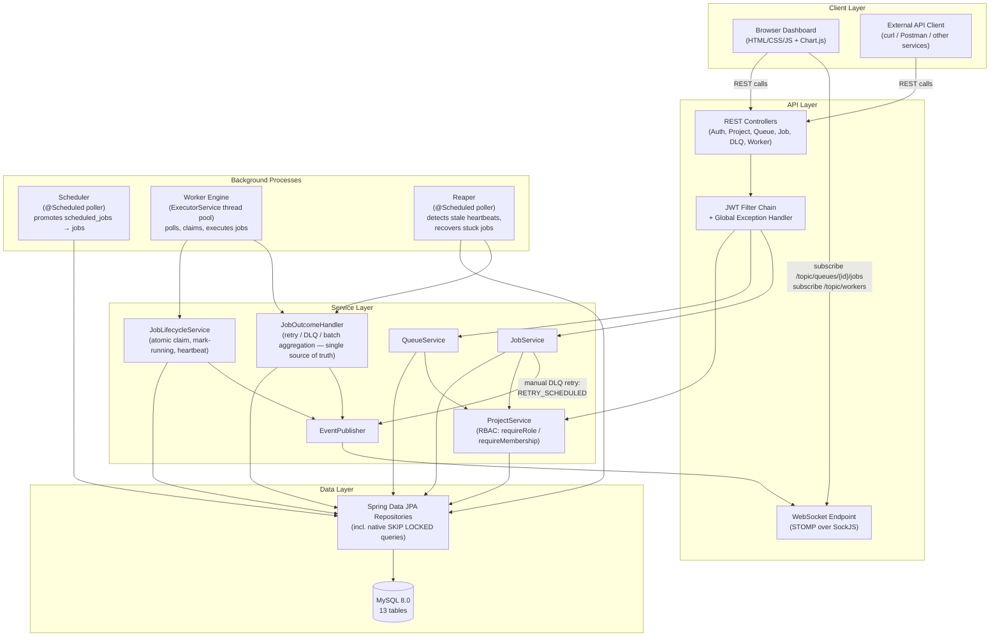
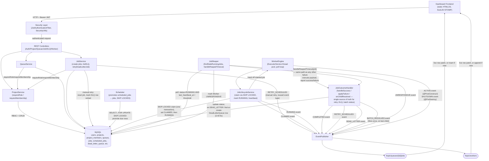

# Architecture

This document describes the structural shape of the system: its major components, how they depend on each other, and how work flows between them. For the reasoning *behind* these choices, see `docs/design_decisions.md`. For the database schema itself, see the ER diagram and table reference in the main `README.md`.

---

## 1. Component overview (simplified)

The system follows a layered, modular architecture with a clear separation between the API layer, the business logic layer, the data layer, and two independent background processes (the Scheduler and the Worker Engine, which includes the Reaper).

---

## 1.1 Detailed component & event-flow diagram

The simplified view above shows *what depends on what*. The diagram below is the same system traced at the level of *which method calls which, and which exact event fires on which topic* — useful when debugging a specific transition (e.g. "why didn't this job's row update live?") rather than getting oriented for the first time.

**What this diagram makes explicit that the simplified one doesn't:**

- The **exact event type** fired at each point (`CLAIMED`, `RUNNING`, `COMPLETED`, `RETRY_SCHEDULED`, `DEAD_LETTER`, `BATCH_RESOLVED`, `ACTIVE`, `UNRESPONSIVE`, `SHUTDOWN`) — see the full reference table in `README.md` §8.8.
- That **`JobService`'s manual DLQ retry** broadcasts directly through `EventPublisher`, bypassing `JobOutcomeHandler` entirely — it *reuses* the `RETRY_SCHEDULED` event type but is a structurally separate code path (this is why `queue.html` needed zero changes to display a manual retry correctly: same event shape, different origin).
- That the **Reaper never talks to the generic Service Layer** — it goes straight to `JobRepository` for detection and straight to `JobOutcomeHandler.handleReapedTimeout` for resolution, which is what makes a crashed-worker failure and a normal execution failure share exactly one code path.
- The **note on the DEAD_LETTER write** (`find-or-create` instead of `always insert`) — this is the fix for the duplicate-insert bug that could otherwise stick a job in `RUNNING` forever and crash the Reaper on every subsequent poll. See `docs/design_decisions.md` for the full incident.
- No arrow from `DB` straight to `Frontend` — the frontend only ever gets data via the REST layer (on load / after an action) or via the WebSocket layer (`EventPublisher` → topics) — never directly.

---

## 2. Layer-by-layer description

### 2.1 API Layer
Spring Boot REST controllers exposing authentication, project, queue, job, Dead Letter Queue, and worker endpoints. A JWT filter chain enforces stateless authentication on every route except auth endpoints, the WebSocket handshake, and static frontend files. A global exception handler (`@RestControllerAdvice`) maps expected exception types to structured HTTP error responses, with a logged catch-all for anything unmapped.

### 2.2 Service Layer
Business logic for queue configuration, job lifecycle transitions, retry-policy evaluation, and RBAC enforcement. Three things are worth calling out structurally:

- **RBAC is centralized**, not duplicated. `ProjectService` exposes `requireRole(...)` and `requireMembership(...)`, and every other service that needs an authorization check calls into these same two methods rather than reimplementing the logic.
- **Failure handling is centralized.** `JobOutcomeHandler` is the single place that decides retry-vs-DLQ and derives batch-parent status, regardless of whether a job failed during normal execution or was recovered by the Reaper after its worker died.
- **The one exception to "all broadcasts flow through JobOutcomeHandler/JobLifecycleService":** a manual DLQ retry (`JobService.retryDeadLetterJob`) resets the job and broadcasts a `RETRY_SCHEDULED` event directly from the service layer, reusing the same event type the automatic retry path uses. It's a deliberate, narrow exception, not an inconsistency — see the detailed diagram above.

### 2.3 Data Access Layer
Spring Data JPA repositories over MySQL. Most are simple `JpaRepository` extensions, but a small number carry hand-written native queries — most importantly the atomic job-claiming query (`SELECT ... FOR UPDATE SKIP LOCKED`) and the equivalent query used by the Scheduler's promotion poll.

### 2.4 Worker Engine
A pool of concurrent worker threads (`ExecutorService`, configurable size) running inside a single worker process. Each thread polls active queues, atomically claims eligible jobs up to each queue's concurrency limit, executes them, and sends periodic heartbeats while a job is running. Claiming and lifecycle transitions are delegated to a dedicated `JobLifecycleService` bean — kept separate from the engine's own class specifically to avoid Spring's `@Transactional` self-invocation pitfall (see design_decisions.md, decision 13).

### 2.5 Scheduler
An independently-scheduled poller responsible for promoting delayed, scheduled, and recurring (cron) jobs from the `scheduled_jobs` staging table into the live `jobs` table once their trigger time arrives, using the same `SKIP LOCKED` discipline as the Worker Engine's claiming query.

### 2.6 Reaper
A second, independently-scheduled poller that detects jobs stuck in `RUNNING` whose owning worker has stopped sending heartbeats. It marks the worker `UNRESPONSIVE` and routes the job through the same `JobOutcomeHandler` used for any other failure — meaning a crashed worker and a normal execution failure are handled by one unified piece of logic, not two. Its dead-letter write path was hardened to find-or-create the existing `DeadLetterQueue` row rather than always inserting, after a live repro surfaced a duplicate-key failure that could otherwise leave a job stuck `RUNNING` and crash the Reaper on every subsequent poll indefinitely (full incident in `docs/design_decisions.md`).

### 2.7 Realtime Layer
Spring WebSocket (STOMP over SockJS) broadcasting job-status and worker-status transitions to connected dashboard clients. Job events go to per-queue topics (`/topic/queues/{queueId}/jobs`); worker events go to a single global topic (`/topic/workers`). Broadcasts fire only on genuine state transitions — heartbeat ticks and aggregate statistics are deliberately excluded and served via polled REST endpoints instead.

### 2.8 Dashboard
A browser-based UI (HTML/CSS/vanilla JS + Chart.js) served as static files from the same backend process — no separate frontend server or build step. It consumes the REST APIs for initial state and CRUD actions, and the WebSocket stream for live status updates, with an auto-reconnect loop if the connection drops.

---

## 3. Request flow examples

### 3.1 Creating and running an immediate job