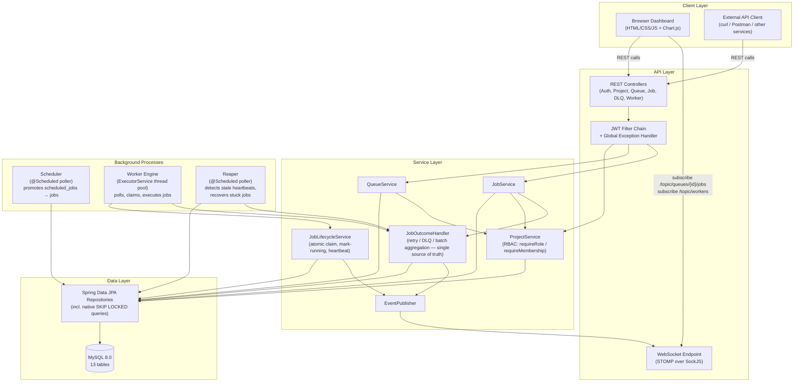

# Architecture

This document describes the structural shape of the system: its major components, how they depend on each other, and how work flows between them. For the reasoning *behind* these choices, see `docs/design_decisions.md`.  For the database schema itself, see the ER diagram and table reference in the main `README.md`.

---

## 1. Component overview

The system follows a layered, modular architecture with a clear separation between the API layer, the business logic layer, the data layer, and two independent background processes (the Scheduler and the Worker Engine, which includes the Reaper).



---

## 2. Layer-by-layer description

### 2.1 API Layer
Spring Boot REST controllers exposing authentication, project, queue, job, Dead Letter Queue, and worker endpoints. A JWT filter chain enforces stateless authentication on every route except auth endpoints, the WebSocket handshake, and static frontend files. A global exception handler (`@RestControllerAdvice`) maps expected exception types to structured HTTP error responses, with a logged catch-all for anything unmapped.

### 2.2 Service Layer
Business logic for queue configuration, job lifecycle transitions, retry-policy evaluation, and RBAC enforcement. Two things are worth calling out structurally:

- **RBAC is centralized**, not duplicated. `ProjectService` exposes `requireRole(...)` and `requireMembership(...)`, and every other service that needs an authorization check calls into these same two methods rather than reimplementing the logic.
- **Failure handling is centralized.** `JobOutcomeHandler` is the single place that decides retry-vs-DLQ and derives batch-parent status, regardless of whether a job failed during normal execution or was recovered by the Reaper after its worker died.

### 2.3 Data Access Layer
Spring Data JPA repositories over MySQL. Most are simple `JpaRepository` extensions, but a small number carry hand-written native queries — most importantly the atomic job-claiming query (`SELECT ... FOR UPDATE SKIP LOCKED`) and the equivalent query used by the Scheduler's promotion poll.

### 2.4 Worker Engine
A pool of concurrent worker threads (`ExecutorService`, configurable size) running inside a single worker process. Each thread polls active queues, atomically claims eligible jobs up to each queue's concurrency limit, executes them, and sends periodic heartbeats while a job is running. Claiming and lifecycle transitions are delegated to a dedicated `JobLifecycleService` bean — kept separate from the engine's own class specifically to avoid Spring's `@Transactional` self-invocation pitfall (see design_decisions.md, decision 13).

### 2.5 Scheduler
An independently-scheduled poller responsible for promoting delayed, scheduled, and recurring (cron) jobs from the `scheduled_jobs` staging table into the live `jobs` table once their trigger time arrives, using the same `SKIP LOCKED` discipline as the Worker Engine's claiming query.

### 2.6 Reaper
A second, independently-scheduled poller that detects jobs stuck in `RUNNING` whose owning worker has stopped sending heartbeats. It marks the worker `UNRESPONSIVE` and routes the job through the same `JobOutcomeHandler` used for any other failure — meaning a crashed worker and a normal execution failure are handled by one unified piece of logic, not two.

### 2.7 Realtime Layer
Spring WebSocket (STOMP over SockJS) broadcasting job-status and worker-status transitions to connected dashboard clients. Job events go to per-queue topics (`/topic/queues/{queueId}/jobs`); worker events go to a single global topic (`/topic/workers`). Broadcasts fire only on genuine state transitions — heartbeat ticks and aggregate statistics are deliberately excluded and served via polled REST endpoints instead.

### 2.8 Dashboard
A browser-based UI (HTML/CSS/vanilla JS + Chart.js) served as static files from the same backend process — no separate frontend server or build step. It consumes the REST APIs for initial state and CRUD actions, and the WebSocket stream for live status updates, with an auto-reconnect loop if the connection drops.

---

## 3. Request flow examples

### 3.1 Creating and running an immediate job
```
Client → POST /api/queues/{id}/jobs/immediate
       → JobController → JobService (RBAC check via ProjectService)
       → Job row inserted, status = QUEUED
       → 201 Created returned to client

[independently, on its own poll cycle]
Worker Engine thread → JobLifecycleService.claimJobs()
       → SELECT ... FOR UPDATE SKIP LOCKED (one transaction)
       → status = CLAIMED, claimed_by_worker_id set
       → EventPublisher broadcasts CLAIMED on /topic/queues/{id}/jobs

Worker thread → markRunning() → status = RUNNING
       → EventPublisher broadcasts RUNNING
       → job executes, heartbeats sent periodically

On completion:
       → JobOutcomeHandler.handleSuccess() → status = COMPLETED
       → EventPublisher broadcasts COMPLETED
```

### 3.2 A worker dying mid-job
```
Worker process is killed while a job is RUNNING
       → heartbeats stop

[on its own poll cycle, independent of the above]
Reaper → finds job: status=RUNNING, last_heartbeat_at older than timeout
       → marks Worker: status = UNRESPONSIVE
       → EventPublisher broadcasts UNRESPONSIVE on /topic/workers
       → routes the job through JobOutcomeHandler exactly as if it had
         failed normally — retry if attempts remain, DEAD_LETTER if exhausted
```

### 3.3 Delayed job promotion
```
Client → POST /api/queues/{id}/jobs/delayed
       → row inserted into scheduled_jobs only, promoted = false
       → (no row exists in `jobs` yet)

[on its own poll cycle]
Scheduler → SELECT ... FOR UPDATE SKIP LOCKED WHERE promoted = false
            AND next_run_time <= NOW()  (one transaction)
       → inserts new row into jobs, status = QUEUED
       → marks scheduled_jobs row promoted = true

[from here, identical to 3.1 — the Worker Engine has no awareness
 of whether a job originated as immediate or promoted]
```

---

## 4. Why this shape, briefly

The Worker Engine, Scheduler, and Reaper are three independent background processes rather than one combined loop, because they answer three different questions on three different natural cadences: *"is there claimable work right now?"*, *"has a scheduled job become due?"*, and *"has a worker gone silent?"*. Keeping them separate means each can be tuned, tested, and reasoned about independently, while still funneling into the same underlying `jobs` table and the same `JobOutcomeHandler` for failure resolution — so there is one shared, consistent notion of "what happens when a job fails," regardless of which of the three processes triggered that failure.

Full reasoning for each structural choice — including alternatives considered and rejected — is in `docs/design_decisions.md`. 
