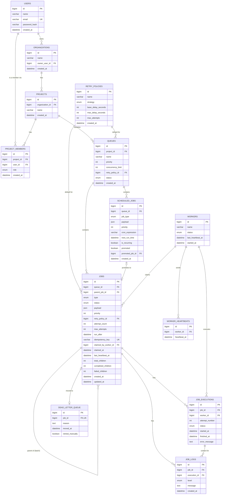

# Database Schema

## ER Diagram

```mermaid
erDiagram
    USERS ||--o{ ORGANIZATIONS : owns
    USERS ||--o{ PROJECT_MEMBERS : "is a member via"
    ORGANIZATIONS ||--o{ PROJECTS : has
    PROJECTS ||--o{ PROJECT_MEMBERS : has
    PROJECTS ||--o{ QUEUES : contains
    RETRY_POLICIES ||--o{ QUEUES : "default for"
    RETRY_POLICIES ||--o{ JOBS : "default for"
    QUEUES ||--o{ JOBS : contains
    QUEUES ||--o{ SCHEDULED_JOBS : contains
    SCHEDULED_JOBS |o--o| JOBS : "promotes to"
    JOBS ||--o{ JOBS : "parent of (batch)"
    JOBS ||--o{ JOB_EXECUTIONS : has
    JOBS ||--o{ JOB_LOGS : has
    JOBS |o--o| DEAD_LETTER_QUEUE : "moved to"
    WORKERS ||--o{ JOBS : claims
    WORKERS ||--o{ WORKER_HEARTBEATS : sends
    WORKERS ||--o{ JOB_EXECUTIONS : executes
    JOB_EXECUTIONS ||--o{ JOB_LOGS : "context for"

    USERS {
        bigint id PK
        varchar name
        varchar email UK
        varchar password_hash
        datetime created_at
    }
    ORGANIZATIONS {
        bigint id PK
        varchar name
        bigint owner_user_id FK
        datetime created_at
    }
    PROJECTS {
        bigint id PK
        bigint organization_id FK
        varchar name
        datetime created_at
    }
    PROJECT_MEMBERS {
        bigint id PK
        bigint project_id FK
        bigint user_id FK
        enum role
        datetime created_at
    }
    RETRY_POLICIES {
        bigint id PK
        varchar name
        enum strategy
        int base_delay_seconds
        int max_delay_seconds
        int max_attempts
        datetime created_at
    }
    QUEUES {
        bigint id PK
        bigint project_id FK
        varchar name
        int priority
        int concurrency_limit
        bigint retry_policy_id FK
        enum status
        datetime created_at
    }
    WORKERS {
        bigint id PK
        varchar name
        enum status
        datetime last_heartbeat_at
        datetime started_at
    }
    WORKER_HEARTBEATS {
        bigint id PK
        bigint worker_id FK
        datetime heartbeat_at
    }
    JOBS {
        bigint id PK
        bigint queue_id FK
        bigint parent_job_id FK
        enum type
        enum status
        json payload
        int priority
        bigint retry_policy_id FK
        int attempt_count
        int max_attempts
        datetime run_after
        varchar idempotency_key UK
        bigint claimed_by_worker_id FK
        datetime claimed_at
        datetime last_heartbeat_at
        int total_children
        int completed_children
        int failed_children
        datetime created_at
        datetime updated_at
    }
    SCHEDULED_JOBS {
        bigint id PK
        bigint queue_id FK
        enum job_type
        json payload
        int priority
        varchar cron_expression
        datetime next_run_time
        boolean is_recurring
        boolean promoted
        bigint promoted_job_id FK
        datetime created_at
    }
    JOB_EXECUTIONS {
        bigint id PK
        bigint job_id FK
        bigint worker_id FK
        int attempt_number
        enum status
        datetime started_at
        datetime finished_at
        text error_message
    }
    JOB_LOGS {
        bigint id PK
        bigint job_id FK
        bigint execution_id FK
        enum level
        text message
        datetime created_at
    }
    DEAD_LETTER_QUEUE {
        bigint id PK
        bigint job_id FK,UK
        text reason
        datetime moved_at
        boolean retried_manually
    }
```

This diagram shows the main data model for projects, queues, jobs, workers, and the retry/DLQ flow.
